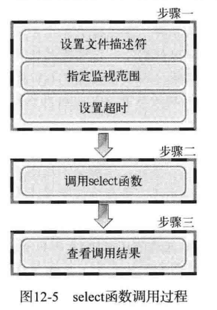

使用 select 函数，通知内核挂起进程，当一个或多个 I/O 事件发生后，控制权返还给应用程序，由应用程序进行 I/O 事件的处理。

I/O 事件的类型非常多，比如： 
+ 标准输入文件描述符准备好可以读。
+ 监听套接字准备好，新的连接已经建立成功。
+ 已连接套接字准备好可以写。
+ 如果一个 I/O 事件等待超过了 10 秒，发生了超时事件。


select 函数的调用过程如下图所示：



## 函数声明

```c
#include <sys/select.h>
#include <sys/time.h>

int select(int maxfd, fd_set *readset, fd_set *writeset,
           fd_set *exceptset, const struct timeval *timeout);

//发生错误时返回 -1, 超时时返回 0,。因发生关注的事件返回时，返回大于 0 的值，该值是发生事件的文件描述符数。
```

+ maxfd: 监视对象文件描述符数量
+ readset: 将所有关注「是否存在待读取数据」的文件描述符注册到 fd_set 型变量，并传递其地址值。
+ writeset: 将所有关注「是否可传输无阻塞数据」的文件描述符注册到 fd_set 型变量，并传递其地址值。
+ exceptset: 将所有关注「是否发生异常」的文件描述符注册到 fd_set 型变量，并传递其地址值。
+ timeout: 调用 select 函数后，为防止陷入无限阻塞的状态，传递超时 (time-out) 信息


-   `FD_ZERO(fd_set *fdset)`：将 fd_set 变量所指的位全部初始化成0
    
-   `FD_SET(int fd,fd_set *fdset)`：在参数 fdset 指向的变量中注册文件描述符 fd 的信息
    
-   `FD_SLR(int fd,fd_set *fdset)`：从参数 fdset 指向的变量中清除文件描述符 fd 的信息
    
-   `FD_ISSET(int fd,fd_set *fdset)`：若参数 fdset 指向的变量中包含文件描述符 fd 的信息，则返回「真」