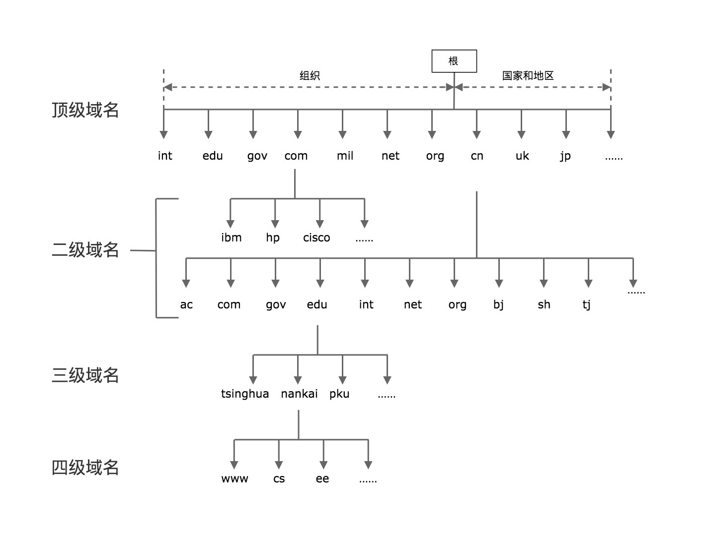

# 02 | 网络编程模型：认识客户端-服务器网络模型的基本概念
你好，我是盛延敏。上一讲我们学习了TCP/IP的创建和历史，以及Linux操作系统的建立和发展，相信你对网络编程这棵大树已经有了一个宏观上的认识，那么今天我们再往前走几步，近距离看看这棵大树的细枝末节到底是怎样的。

从哪里开始呢？从网络编程的基本概念开始说起吧。

## 客户端-服务器网络编程模型

在谈论网络编程时，我们首先需要建立一个概念，也就是我们今天的主题“客户端-服务器”。

拿我们常用的网络购物来说，我们在手机上的每次操作，都是作为客户端向服务器发送请求，并收到响应的例子。

这个过程具体阐释如下：


1. 当一个客户端需要服务时，比如网络购物下单，它会向服务器端发送一个请求。注意，这个请求是按照双方约定的格式来发送的，以便保证服务器端是可以理解的；
2. 服务器端收到这个请求后，会根据双方约定的格式解释它，并且以合适的方式进行操作，比如调用数据库操作来创建一个购物单；
3. 服务器端完成处理请求之后，会给客户端发送一个响应，比如向客户端发送购物单的实际付款额，然后等待客户端的下一步操作；
4. 客户端收到响应并进行处理，比如在手机终端上显示该购物单的实际付款额，并且让用户选择付款方式。

在网络编程中，具体到客户端-服务器模型时，我们经常会考虑是使用TCP还是UDP，其实它们二者的区别也很简单：TCP中连接是谁发起的，在UDP中报文是谁发送的。在TCP通信中，建立连接是一个非常重要的环节。区别出客户端和服务器，本质上是因为二者编程模型是不同的。

服务器端需要在一开始就监听在一个众所周知的端口上，等待客户端发送请求，一旦有客户端连接建立，服务器端就会消耗一定的计算机资源为它服务，服务器端是需要同时为成千上万的客户端服务的。如何保证服务器端在数据量巨大的客户端访问时依然能维持效率和稳定，这也是我们讲述高性能网络编程的目的。

客户端相对来说更为简单，它向服务器端的监听端口发起连接请求，连接建立之后，通过连接通路和服务器端进行通信。

**还有一点需要强调的是，无论是客户端，还是服务器端，它们运行的单位都是进程（process），而不是机器**。一个客户端，比如我们的手机终端，同一个时刻可以建立多个到不同服务器的连接，比如同时打游戏，上知乎，逛天猫；而服务器端更是可能在一台机器上部署运行了多个服务，比如同时开启了SSH服务和HTTP服务。

## IP和端口

正如寄信需要一个地址一样，在网络世界里，同样也需要地址的概念。在TCP/IP协议栈中，IP用来表示网络世界的地址。

前面我们提到了，在一台计算机上是可以同时存在多个连接的，那么如何区分出不同的连接呢？

这里就必须提到端口这个概念。我们拿住酒店举例子，酒店的地址是唯一的，每间房间的号码是不同的，类似的，计算机的IP地址是唯一的，每个连接的端口号是不同的。

端口号是一个16位的整数，最多为65536。当一个客户端发起连接请求时，客户端的端口是由操作系统内核临时分配的，称为临时端口；然而，前面也提到过，服务器端的端口通常是一个众所周知的端口。

一个连接可以通过客户端-服务器端的IP和端口唯一确定，这叫做套接字对，按照下面的四元组表示：

```
（clientaddr:clientport, serveraddr: serverport)

```

下图表示了一个客户端-服务器之间的连接：


## 保留网段

一个比较常见的现象是，我们所在的单位或者组织，普遍会使用诸如10.0.x.x或者192.168.x.x这样的IP地址，你可能会纳闷，这样的IP到底代表了什么呢？不同的组织使用同样的IP会不会导致冲突呢?

背后的原因是这样的，国际标准组织在IPv4地址空间里面，专门划出了一些网段，这些网段不会用做公网上的IP，而是仅仅保留作内部使用，我们把这些地址称作保留网段。

下表是三个保留网段，其可以容纳的计算机主机个数分别是16777216个、1048576个和65536个。


在详细讲述这个表格之前，我们需要首先了解一下子网掩码的概念。

## 子网掩码

在网络IP划分的时候，我们需要区分两个概念。

第一是网络（network）的概念，直观点说，它表示的是这组IP共同的部分，比如在192.168.1.1~192.168.1.255这个区间里，它们共同的部分是192.168.1.0。

第二是主机（host）的概念，它表示的是这组IP不同的部分，上面的例子中1~255就是不同的那些部分，表示有255个可用的不同IP。

例如 IPv4 地址，192.0.2.12，我们可以说前⾯3个字节（byte） 是⼦⽹（subnet），最后1个字节是主机，或者换个⽅式，我们能说主机为 8 位，⼦⽹掩码为192.0.2.0/24（255.255.255.0）。

有点晕？别着急，接下来要讲的是一些基本概念。

很久很久以前，有子网（subnet）的分类，在这里，一个IPv4地址的第一个，前两个或前三个 字节是属于网络的一部分。

如果你很幸运地可以拥有IPv4地址的第1个字节⽹络，另外3个字节表示主机地址，那在你的⽹络⾥，你有价值3个字节，也就是24个⽐特的主机地址，这是什么概念呢？ 2 的 24 次⽅，⼤约是⼀千六百万个地址左右（图中Number of addresses）。这是⼀个“Class A”（A 类）⽹络。


我们再来重新看⼀下这张表格，表格第⼀⾏就是这样⼀个 A 类⽹络，10对应的是⽹络字节部分，主机部分是3个字节，我们将第⼀个字节的⼦⽹掩码记作 255.0.0.0。

相对的，“Class B”（B 类）的网络，网络有两个字节，而 host 只有两个字节，也就是说拥有的主机个数为65536。“Class C”（C 类）的网络，网络有三个 字节，而 host 只有一个 字节，也就是说拥有的主机个数为256。

网络地址位数由子网掩码（Netmask）决定，你可以将IP地址与子网掩码进行“位与”操作，就能得到网络的值。子网掩码一般看起来像是 255.255.255.0（二进制为11111111.11111111.11111111.00000000），比如你的IP是192.0.2.12，使用这个子网掩码时，你的网络就会是192.0.2.12与255.255.255.0所得到的值：192.0.2.0，192.0.2.0就是这个网络的值。

子网掩码能接受任意个位，而不单纯是上面讨论的8，16或24个比特而已。所以你可以有一个子网掩码255.255.255.252（二进制位11111111.11111111.11111111.11111100），这个子网掩码能切出一个30个位的网络以及2个位的主机，这个网络最多有四台主机。为什么是4台主机呢？因为不变的部分只有最后两位，所有的可能为2的2次方，即4台主机。

注意，子网掩码的格式永远都是二进制格式：前面是一连串的 1，后面跟着一连串的 0。

不过一大串的数字会有点不好用，比如像 255.192.0.0 这样的子网掩码，人们无法直观地知道有多少个1，多少个0，后来人们发明了新的办法，你只需要将一个斜线放在IP地址后面，接着用一个十进制的数字用以表示网络的位数，类似这样：192.0.2.12/30, 这样就很容易知道有30个1， 2个0，所以主机个数为4。

最后，再强调一点，实际可以用的主机数目，一般要减去⼴播地址(全1的地址)和不可用的地址(全0的地址)。也就是说，图中的Number of addresse(即地址数)，如果换算为真实的主机数，是需要减去2的。

相信这个时候再去看保留网段，你应该能理解表格里的内容了。这里就不再赘述。

## 全球域名系统

如果每次要访问一个服务，都要记下这个服务对应的IP地址，无疑是一种枯燥而繁琐的事情，就像你要背下200多个好友的电话号码一般无聊。

此时，你应该知道我将要表达什么。对的，正如电话簿记录了好友和电话的对应关系一样，域名（DNS）也记录了网站和IP的对应关系。

全球域名按照从大到小的结构，形成了一棵树状结构。实际访问一个域名时，是从最底层开始写起，例如 [www.google.com](http://www.google.com,)， [www.tinghua.edu.cn](http://www.tinghua.edu.cn) 等。



## 数据报和字节流

尽管名称是TCP/IP协议栈，但是从上一讲关于OSI和TCP/IP协议栈的对比中，我们看到传输层其实是有两种协议的，一种是大家广为熟悉的TCP， 而另一种就是UDP。

TCP，又被叫做字节流套接字（Stream Socket），注意我们这里先引入套接字socket，套接字socket在后面几讲中将被反复提起，因为它实际上是网络编程的核心概念。当然，UDP也有一个类似的叫法, 数据报套接字（Datagram Socket），一般分别以“SOCK\_STREAM”与“SOCK\_DGRAM”分别来表示TCP和UDP套接字。

Datagram Sockets 有时称为“无连接的sockets”（connectionless sockets）。

Stream sockets 是可靠的、双向连接的通讯串流。比如以“1-2-3”的顺序将字节流输出到套接字上，它们在另一端一定会以“1-2-3”的顺序抵达，而且不会出错。

这种高质量的通信是如何办到的呢？这就是由TCP（Transmission Control Protocol）协议完成的，TCP通过诸如连接管理，拥塞控制，数据流与窗口管理，超时和重传等一系列精巧而详细的设计，提供了高质量的端到端的通信方式。

这部分内容不是我们这里讲解的重点，有感兴趣的同学可以去读《TCP/IP详解卷一：协议》 。

我们平时使用浏览器访问网页，或者在手机端用天猫App购物时，使用的都是字节流套接字。

等等，如果是这样，世界都用TCP好了，哪里有UDP什么事呢？

事实上，UDP在很多场景也得到了极大的应用，比如多人联网游戏、视频会议，甚至聊天室。如果你听说过NTP，你一定很惊讶NTP也是用UDP实现的。

使用UDP的原因，第一是速度，第二还是速度。

想象一下，一个有上万人的联网游戏，如果要给每个玩家同步游戏中其他玩家的位置信息，而且丢失一两个也不会造成多大的问题，那么UDP是一个比较经济合算的选择。

还有一种叫做广播或多播的技术，就是向网络中的多个节点同时发送信息，这个时候，选择UDP更是非常合适的。

UDP也可以做到更高的可靠性，只不过这种可靠性，需要应用程序进行设计处理，比如对报文进行编号，设计Request-Ack机制，再加上重传等，在一定程度上可以达到更为高可靠的UDP程序。当然，这种可靠性和TCP相比还是有一定的距离，不过也可以弥补实战中UDP的一些不足。

在后面的章节中，我们将会分别介绍TCP和UDP的网络编程技术。

## 总结

这一讲我们主要介绍了客户端-服务器网络编程模型，初步介绍了IP地址、端口、子网掩码和域名等基础概念，以下知识点你需要重点关注一下：

1. 网络编程需要牢牢建立起“客户端”和“服务器”模型，两者编程的方法和框架是明显不同的。
2. TCP连接是客户端-服务器的IP和端口四元组唯一确定的，IP是一台机器在网络世界的唯一标识。
3. 有两种截然不同的传输层协议，面向连接的“数据流”协议TCP，以及无连接的“数据报”协议UDP。

从下一讲开始，我们将开始使用套接字编写我们的第一个客户端-服务器程序。

## 思考题

最后给你布置几个思考题。

我们看到保留地址中第二行172.16.0.0/12描述为16个连续的B段，第三行192.168.0.0/16描述为256个连续的C段地址，怎么理解这种描述呢？

另外，章节里提到了服务端必须侦听在一个众所周知的端口上，这个端口怎么选择，又是如何让客户端知道的呢？

如果你仔细想过这个问题，欢迎在评论区写下你的思考，也欢迎把这篇文章分享给你的朋友或者同事，大家一起交流一下。