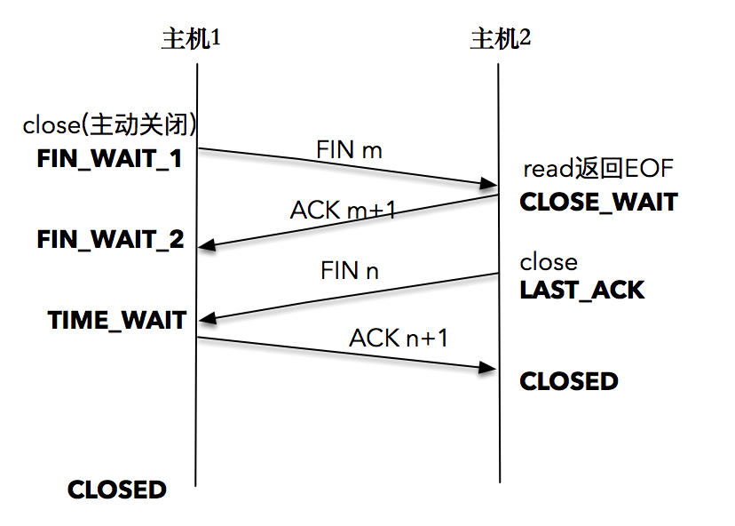

# 19丨提高篇答疑：如何理解TCP四次挥手？
你好，我是盛延敏，这里是网络编程实战第19讲，欢迎回来。

这一篇文章是提高篇的答疑部分，也是提高篇的最后一篇文章。非常感谢大家的积极评论与留言，让每一篇文章的留言区都成为学习互动的好地方。在今天的内容里，我将针对大家的问题做一次集中回答，希望能帮助你解决前面碰到的一些问题。

这部分，我将采用Q&A的形式来展开。

## 如何理解TCP四次挥手？

TCP建立一个连接需3次握手，而终止一个连接则需要四次挥手。四次挥手的整个过程是这样的：



首先，一方应用程序调用close，我们称该方为主动关闭方，该端的TCP发送一个FIN包，表示需要关闭连接。之后主动关闭方进入FIN\_WAIT\_1状态。

接着，接收到这个FIN包的对端执行被动关闭。这个FIN由TCP协议栈处理，我们知道，TCP协议栈为FIN包插入一个文件结束符EOF到接收缓冲区中，应用程序可以通过read调用来感知这个FIN包。一定要注意，这个EOF会被放在 **已排队等候的其他已接收的数据之后**，这就意味着接收端应用程序需要处理这种异常情况，因为EOF表示在该连接上再无额外数据到达。此时，被动关闭方进入CLOSE\_WAIT状态。

接下来，被动关闭方将读到这个EOF，于是，应用程序也调用close关闭它的套接字，这导致它的TCP也发送一个FIN包。这样，被动关闭方将进入LAST\_ACK状态。

最终，主动关闭方接收到对方的FIN包，并确认这个FIN包。主动关闭方进入TIME\_WAIT状态，而接收到ACK的被动关闭方则进入CLOSED状态。经过2MSL时间之后，主动关闭方也进入CLOSED状态。

你可以看到，每个方向都需要一个FIN和一个ACK，因此通常被称为四次挥手。

当然，这中间使用shutdown，执行一端到另一端的半关闭也是可以的。

当套接字被关闭时，TCP为其所在端发送一个FIN包。在大多数情况下，这是由应用进程调用close而发生的，值得注意的是，一个进程无论是正常退出（exit或者main函数返回），还是非正常退出（比如，收到SIGKILL信号关闭，就是我们常常干的kill -9），所有该进程打开的描述符都会被系统关闭，这也导致TCP描述符对应的连接上发出一个FIN包。

无论是客户端还是服务器，任何一端都可以发起主动关闭。大多数真实情况是客户端执行主动关闭，你可能不会想到的是，HTTP/1.0却是由服务器发起主动关闭的。

## 最大分组 MSL是TCP 分组在网络中存活的最长时间吗？

MSL是任何IP数据报能够在因特网中存活的最长时间。其实它的实现不是靠计时器来完成的，在每个数据报里都包含有一个被称为TTL（time to live）的8位字段，它的最大值为255。TTL可译为“生存时间”，这个生存时间由源主机设置初始值，它表示的是一个IP数据报可以经过的最大跳跃数，每经过一个路由器，就相当于经过了一跳，它的值就减1，当此值减为0时，则所在的路由器会将其丢弃，同时发送ICMP报文通知源主机。RFC793中规定MSL的时间为2分钟，Linux实际设置为30秒。

## 关于listen函数中参数backlog的释义问题

我们该如何理解listen函数中的参数backlog？如果backlog表示的是未完成连接队列的大小，那么已完成连接的队列的大小有限制吗？如果都是已经建立连接的状态，那么并发取决于已完成连接的队列的大小吗？

backlog的值含义从来就没有被严格定义过。原先Linux实现中，backlog参数定义了该套接字对应的未完成连接队列的最大长度 （pending connections)。如果一个连接到达时，该队列已满，客户端将会接收一个ECONNREFUSED的错误信息，如果支持重传，该请求可能会被忽略，之后会进行一次重传。

从Linux 2.2开始，backlog的参数内核有了新的语义，它现在定义的是已完成连接队列的最大长度，表示的是已建立的连接（established connection），正在等待被接收（accept调用返回），而不是原先的未完成队列的最大长度。现在，未完成队列的最大长度值可以通过 /proc/sys/net/ipv4/tcp\_max\_syn\_backlog完成修改，默认值为128。

至于已完成连接队列，如果声明的backlog参数比 /proc/sys/net/core/somaxconn的参数要大，那么就会使用我们声明的那个值。实际上，这个默认的值为128。注意在Linux 2.4.25之前，这个值是不可以修改的一个固定值，大小也是128。

设计良好的程序，在128固定值的情况下也是可以支持成千上万的并发连接的，这取决于I/O分发的效率，以及多线程程序的设计。在后面的性能篇里，我们的目标就是设计这样的程序。

## UDP连接和断开套接字的过程是怎样的？

UDP连接套接字不是发起连接请求的过程，而是记录目的地址和端口到套接字的映射关系。

断开套接字则相反，将删除原来记录的映射关系。

## 在UDP中不进行connect，为什么客户端会收到信息？

有人说，如果按照我在文章中的说法，UDP只有connect才建立socket和IP地址的映射，那么如果不进行connect，收到信息后内核又如何把数据交给对应的socket？

这个问题非常有意思。我刚刚看到这个问题的时候，心里也在想，是啊，我是不是说错了？

其实呢，这对应了两个不同的API场景。

第一个场景就是我这里讨论的connect场景，在这个场景里，我们讨论的是ICMP报文和socket之间的定位。我们知道，ICMP报文发送的是一个不可达的信息，不可达的信息是通过 **目的地址和端口** 来区分的，如果没有connect操作， **目的地址和端口** 就没有办法和socket套接字进行对应，所以，即使收到了ICMP报文，内核也没有办法通知到对应的应用程序，告诉它连接地址不可达。

那么为什么在不connect的情况下，我们的客户端又可以收到服务器回显的信息了？

这就涉及到了第二个场景，也就是报文发送的场景。注意服务器端程序，先通过recvfrom函数调用获取了客户端的地址和端口信息，这当然是可以的，因为UDP报文里面包含了这部分信息。然后我们看到服务器端又通过调用sendto函数，把客户端的地址和端口信息告诉了内核协议栈，可以肯定的是，之后发送的UDP报文就带上了 **客户端的地址和端口信息**，通过客户端的地址和端口信息，可以找到对应的套接字和应用程序，完成数据的收发。

```
//服务器端程序，先通过recvfrom函数调用获取了客户端的地址和端口信息
int n = recvfrom(socket_fd, message, MAXLINE, 0, (struct sockaddr *) &client_addr, &client_len);
message[n] = 0;
printf("received %d bytes: %s\n", n, message);

char send_line[MAXLINE];
sprintf(send_line, "Hi, %s", message);

//服务器端程序调用send函数，把客户端的地址和端口信息告诉了内核
sendto(socket_fd, send_line, strlen(send_line), 0, (struct sockaddr *) &client_addr, client_len);

```

从代码中可以看到，这里的connect的作用是记录 **客户端目的地址和端口–套接字** 的关系，而之所以能正确收到从服务器端发送的报文，那是因为系统已经记录了 **客户端源地址和端口–套接字** 的映射关系。

## 我们是否可以对一个 UDP套接字进行多次connect的操作?

我们知道，对于TCP套接字，connect只能调用一次。但是，对一个UDP套接字来说，进行多次connect操作是被允许的，这样主要有两个作用。

第一个作用是可以重新指定新的IP地址和端口号；第二个作用是可以断开一个已连接的套接字。为了断开一个已连接的UDP套接字，第二次调用connect时，调用方需要把套接字地址结构的地址族成员设置为AF\_UNSPEC。

## 第11讲中程序和时序图的解惑

在11讲中，我们讲了关闭连接的几种方式，有同学对这一篇文章中的程序和时序图存在疑惑，并提出了下面几个问题：

1. 代码运行结果是先显示hi data1，之后才接收到标准输入的close，为什么时序图中画的是先close才接收到hi data1？
2. 当一方主动close之后，另一方发送数据的时候收到RST。主动方缓冲区会把这个数据丢弃吗？这样的话，应用层应该读不到了吧？
3. 代码中SIGPIPE的作用不是忽略吗？为什么服务器端会退出？
4. 主动调用socket的那方关闭了写端，但是还没关闭读端，这时候socket再读到数据是不是就是RST？然后再SIGPIPE？如果是这样的话，为什么不一次性把读写全部关闭呢？

我还是再仔细讲一下这个程序和时序图。

首先回答问题1。针对close这个例子，时序图里画的close表示的是客户端发起的close调用。

关于问题2，“Hi, data1”确实是不应该被接收到的，这个数据报即使发送出去也会收到RST回执，应用层是读不到的。

关于问题3中SIGPIPE的作用，事实上，默认的SIGPIPE忽略行为就是退出程序，什么也不做，当然，实际程序还是要做一些清理工作的。

问题4的理解是错误的。第二个例子也显示了，如果主动关闭的一方调用shutdown关闭，没有关闭读这一端，主动关闭的一方可以读到对端的数据，注意这个时候主动关闭连接的一方是在使用read方法进行读操作，而不是write写操作，不会有RST的发生，更不会有SIGPIPE的发生。


## 总结

以上就是提高篇中一些同学的疑问。我们常说，学问学问，有学才有问。我希望通过今天的答疑可以让你加深对文章的理解，为后面的模块做准备。

这篇文章之后，我们就将进入到专栏中最重要的部分，也就是性能篇和实战篇了，在性能篇和实战篇里，我们将会使用到之前学到的知识，逐渐打造一个高性能的网络程序框架，你，准备好了吗？

如果你觉得今天的答疑内容对你有所帮助，欢迎把它转发给你的朋友或者同事，一起交流一下。