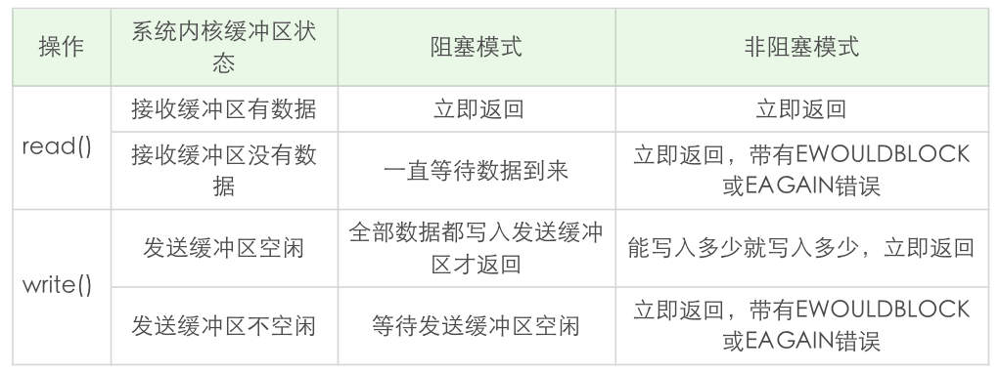

# 22 | 非阻塞I/O：提升性能的加速器
你好，我是盛延敏，这里是网络编程实战第22讲，欢迎回来。

在性能篇的前两讲中，我分别介绍了select和poll两种不同的I/O多路复用技术。在接下来的这一讲中，我将带大家进入非阻塞I/O模式的世界。事实上，非阻塞I/O配合I/O多路复用，是高性能网络编程中的常见技术。

## 阻塞 VS 非阻塞

当应用程序调用阻塞I/O完成某个操作时，应用程序会被挂起，等待内核完成操作，感觉上应用程序像是被“阻塞”了一样。实际上，内核所做的事情是将CPU时间切换给其他有需要的进程，网络应用程序在这种情况下就会得不到CPU时间做该做的事情。

非阻塞I/O则不然，当应用程序调用非阻塞I/O完成某个操作时，内核立即返回，不会把CPU时间切换给其他进程，应用程序在返回后，可以得到足够的CPU时间继续完成其他事情。

如果拿去书店买书举例子，阻塞I/O对应什么场景呢？ 你去了书店，告诉老板（内核）你想要某本书，然后你就一直在那里等着，直到书店老板翻箱倒柜找到你想要的书，有可能还要帮你联系全城其它分店。注意，这个过程中你一直滞留在书店等待老板的回复，好像在书店老板这里"阻塞"住了。

那么非阻塞I/O呢？你去了书店，问老板有没你心仪的那本书，老板查了下电脑，告诉你没有，你就悻悻离开了。一周以后，你又来这个书店，再问这个老板，老板一查，有了，于是你买了这本书。注意，这个过程中，你没有被阻塞，而是在不断轮询。

但轮询的效率太低了，于是你向老板提议：“老板，到货给我打电话吧，我再来付钱取书。”这就是前面讲到的I/O多路复用。

再进一步，你连去书店取书也想省了，得了，让老板代劳吧，你留下地址，付了书费，让老板到货时寄给你，你直接在家里拿到就可以看了。这就是我们将会在第30讲中讲到的异步I/O。

这几个I/O模型，再加上进程、线程模型，构成了整个网络编程的知识核心。

按照使用场景，非阻塞I/O可以被用到读操作、写操作、接收连接操作和发起连接操作上。接下来，我们对它们一一解读。

## 非阻塞I/O

### 读操作

如果套接字对应的接收缓冲区没有数据可读，在非阻塞情况下read调用会立即返回，一般返回EWOULDBLOCK或EAGAIN出错信息。在这种情况下，出错信息是需要小心处理，比如后面再次调用read操作，而不是直接作为错误直接返回。这就好像去书店买书没买到离开一样，需要不断进行又一次轮询处理。

### 写操作

不知道你有没有注意到，在阻塞I/O情况下，write函数返回的字节数，和输入的参数总是一样的。如果返回值总是和输入的数据大小一样，write等写入函数还需要定义返回值吗？我不知道你是不是和我一样，刚接触到这一部分知识的时候有这种困惑。

这里就要引出我们所说的非阻塞I/O。在非阻塞I/O的情况下，如果套接字的发送缓冲区已达到了极限，不能容纳更多的字节，那么操作系统内核会 **尽最大可能** 从应用程序拷贝数据到发送缓冲区中，并立即从write等函数调用中返回。可想而知，在拷贝动作发生的瞬间，有可能一个字符也没拷贝，有可能所有请求字符都被拷贝完成，那么这个时候就需要返回一个数值，告诉应用程序到底有多少数据被成功拷贝到了发送缓冲区中，应用程序需要再次调用write函数，以输出未完成拷贝的字节。

write等函数是可以同时作用到阻塞I/O和非阻塞I/O上的，为了复用一个函数，处理非阻塞和阻塞I/O多种情况，设计出了写入返回值，并用这个返回值表示实际写入的数据大小。

也就是说，非阻塞I/O和阻塞I/O处理的方式是不一样的。

非阻塞I/O需要这样：拷贝→返回→再拷贝→再返回。

而阻塞I/O需要这样：拷贝→直到所有数据拷贝至发送缓冲区完成→返回。

不过在实战中，你可以不用区别阻塞和非阻塞I/O，使用循环的方式来写入数据就好了。只不过在阻塞I/O的情况下，循环只执行一次就结束了。

我在前面的章节中已经介绍了类似的方案，你可以看到writen函数的实现。

```
/* 向文件描述符fd写入n字节数 */
ssize_t writen(int fd, const void * data, size_t n)
{
    size_t      nleft;
    ssize_t     nwritten;
    const char  *ptr;

    ptr = data;
    nleft = n;
    //如果还有数据没被拷贝完成，就一直循环
    while (nleft > 0) {
        if ( (nwritten = write(fd, ptr, nleft)) <= 0) {
           /* 这里EAGAIN是非阻塞non-blocking情况下，通知我们再次调用write() */
            if (nwritten < 0 && errno == EAGAIN)
                nwritten = 0;
            else
                return -1;         /* 出错退出 */
        }

        /* 指针增大，剩下字节数变小*/
        nleft -= nwritten;
        ptr   += nwritten;
    }
    return n;
}

```

下面我通过一张表来总结一下read和write在阻塞模式和非阻塞模式下的不同行为特性：



关于read和write还有几个结论，你需要把握住：

1. read总是在接收缓冲区有数据时就立即返回，不是等到应用程序给定的数据充满才返回。当接收缓冲区为空时，阻塞模式会等待，非阻塞模式立即返回-1，并有EWOULDBLOCK或EAGAIN错误。
2. 和read不同，阻塞模式下，write只有在发送缓冲区足以容纳应用程序的输出字节时才返回；而非阻塞模式下，则是能写入多少就写入多少，并返回实际写入的字节数。
3. 阻塞模式下的write有个特例, 就是对方主动关闭了套接字，这个时候write调用会立即返回，并通过返回值告诉应用程序实际写入的字节数，如果再次对这样的套接字进行write操作，就会返回失败。失败是通过返回值-1来通知到应用程序的。

### accept

当accept和I/O多路复用select、poll等一起配合使用时，如果在监听套接字上触发事件，说明有连接建立完成，此时调用accept肯定可以返回已连接套接字。这样看来，似乎把监听套接字设置为非阻塞，没有任何好处。

为了说明这个问题，我们构建一个客户端程序，其中最关键的是，一旦连接建立，设置SO\_LINGER套接字选项，把l\_onoff标志设置为1，把l\_linger时间设置为0。这样，连接被关闭时，TCP套接字上将会发送一个RST。

```
struct linger ling;
ling.l_onoff = 1;
ling.l_linger = 0;
setsockopt(socket_fd, SOL_SOCKET, SO_LINGER, &ling, sizeof(ling));
close(socket_fd);

```

服务器端使用select I/O多路复用，不过，监听套接字仍然是blocking的。如果监听套接字上有事件发生，休眠5秒，以便模拟高并发场景下的情形。

```
if (FD_ISSET(listen_fd, &readset)) {
    printf("listening socket readable\n");
    sleep(5);
    struct sockaddr_storage ss;
    socklen_t slen = sizeof(ss);
    int fd = accept(listen_fd, (struct sockaddr *) &ss, &slen);

```

这里的休眠时间非常关键，这样，在监听套接字上有可读事件发生时，并没有马上调用accept。由于客户端发生了RST分节，该连接被接收端内核从自己的已完成队列中删除了，此时再调用accept，由于没有已完成连接（假设没有其他已完成连接），accept一直阻塞，更为严重的是，该线程再也没有机会对其他I/O事件进行分发，相当于该服务器无法对其他I/O进行服务。

如果我们将监听套接字设为非阻塞，上述的情形就不会再发生。只不过对于accept的返回值，需要正确地处理各种看似异常的错误，例如忽略EWOULDBLOCK、EAGAIN等。

这个例子给我们的启发是，一定要将监听套接字设置为非阻塞的，尽管这里休眠时间5秒有点夸张，但是在极端情况下处理不当的服务器程序是有可能碰到例子所阐述的情况，为了让服务器程序在极端情况下工作正常，这点工作还是非常值得的。

### connect

在非阻塞TCP套接字上调用connect函数，会立即返回一个EINPROGRESS错误。TCP三次握手会正常进行，应用程序可以继续做其他初始化的事情。当该连接建立成功或者失败时，通过I/O多路复用select、poll等可以进行连接的状态检测。

## 非阻塞I/O + select多路复用

我在这里给出了一个非阻塞I/O搭配select多路复用的例子。

```
#define MAX_LINE 1024
#define FD_INIT_SIZE 128

char rot13_char(char c) {
    if ((c >= 'a' && c <= 'm') || (c >= 'A' && c <= 'M'))
        return c + 13;
    else if ((c >= 'n' && c <= 'z') || (c >= 'N' && c <= 'Z'))
        return c - 13;
    else
        return c;
}

//数据缓冲区
struct Buffer {
    int connect_fd;  //连接字
    char buffer[MAX_LINE];  //实际缓冲
    size_t writeIndex;      //缓冲写入位置
    size_t readIndex;       //缓冲读取位置
    int readable;           //是否可以读
};

struct Buffer *alloc_Buffer() {
    struct Buffer *buffer = malloc(sizeof(struct Buffer));
    if (!buffer)
        return NULL;
    buffer->connect_fd = 0;
    buffer->writeIndex = buffer->readIndex = buffer->readable = 0;
    return buffer;
}

void free_Buffer(struct Buffer *buffer) {
    free(buffer);
}

int onSocketRead(int fd, struct Buffer *buffer) {
    char buf[1024];
    int i;
    ssize_t result;
    while (1) {
        result = recv(fd, buf, sizeof(buf), 0);
        if (result <= 0)
            break;

        for (i = 0; i < result; ++i) {
            if (buffer->writeIndex < sizeof(buffer->buffer))
                buffer->buffer[buffer->writeIndex++] = rot13_char(buf[i]);
            if (buf[i] == '\n') {
                buffer->readable = 1;  //缓冲区可以读
            }
        }
    }

    if (result == 0) {
        return 1;
    } else if (result < 0) {
        if (errno == EAGAIN)
            return 0;
        return -1;
    }

    return 0;
}

int onSocketWrite(int fd, struct Buffer *buffer) {
    while (buffer->readIndex < buffer->writeIndex) {
        ssize_t result = send(fd, buffer->buffer + buffer->readIndex, buffer->writeIndex - buffer->readIndex, 0);
        if (result < 0) {
            if (errno == EAGAIN)
                return 0;
            return -1;
        }

        buffer->readIndex += result;
    }

    if (buffer->readIndex == buffer->writeIndex)
        buffer->readIndex = buffer->writeIndex = 0;

    buffer->readable = 0;

    return 0;
}

int main(int argc, char **argv) {
    int listen_fd;
    int i, maxfd;

    struct Buffer *buffer[FD_INIT_SIZE];
    for (i = 0; i < FD_INIT_SIZE; ++i) {
        buffer[i] = alloc_Buffer();
    }

    listen_fd = tcp_nonblocking_server_listen(SERV_PORT);

    fd_set readset, writeset, exset;
    FD_ZERO(&readset);
    FD_ZERO(&writeset);
    FD_ZERO(&exset);

    while (1) {
        maxfd = listen_fd;

        FD_ZERO(&readset);
        FD_ZERO(&writeset);
        FD_ZERO(&exset);

        // listener加入readset
        FD_SET(listen_fd, &readset);

        for (i = 0; i < FD_INIT_SIZE; ++i) {
            if (buffer[i]->connect_fd > 0) {
                if (buffer[i]->connect_fd > maxfd)
                    maxfd = buffer[i]->connect_fd;
                FD_SET(buffer[i]->connect_fd, &readset);
                if (buffer[i]->readable) {
                    FD_SET(buffer[i]->connect_fd, &writeset);
                }
            }
        }

        if (select(maxfd + 1, &readset, &writeset, &exset, NULL) < 0) {
            error(1, errno, "select error");
        }

        if (FD_ISSET(listen_fd, &readset)) {
            printf("listening socket readable\n");
            sleep(5);
            struct sockaddr_storage ss;
            socklen_t slen = sizeof(ss);
           int fd = accept(listen_fd, (struct sockaddr *) &ss, &slen);
            if (fd < 0) {
                error(1, errno, "accept failed");
            } else if (fd > FD_INIT_SIZE) {
                error(1, 0, "too many connections");
                close(fd);
            } else {
                make_nonblocking(fd);
                if (buffer[fd]->connect_fd == 0) {
                    buffer[fd]->connect_fd = fd;
                } else {
                    error(1, 0, "too many connections");
                }
            }
        }

        for (i = 0; i < maxfd + 1; ++i) {
            int r = 0;
            if (i == listen_fd)
                continue;

            if (FD_ISSET(i, &readset)) {
                r = onSocketRead(i, buffer[i]);
            }
            if (r == 0 && FD_ISSET(i, &writeset)) {
                r = onSocketWrite(i, buffer[i]);
            }
            if (r) {
                buffer[i]->connect_fd = 0;
                close(i);
            }
        }
    }
}

```

第93行，调用fcntl将监听套接字设置为非阻塞。

```
fcntl(fd, F_SETFL, O_NONBLOCK);

```

第121行调用select进行I/O事件分发处理。

131-142行在处理新的连接套接字，注意这里也把连接套接字设置为非阻塞的。

151-156行在处理连接套接字上的I/O读写事件，这里我们抽象了一个Buffer对象，Buffer对象使用了readIndex和writeIndex分别表示当前缓冲的读写位置。

## 实验

启动该服务器：

```
$./nonblockingserver

```

使用多个telnet客户端连接该服务器，可以验证交互正常。

```
$telnet 127.0.0.1 43211
Trying 127.0.0.1...
Connected to localhost.
Escape character is '^]'.
fasfasfasf
snfsnfsnfs

```

## 总结

非阻塞I/O可以使用在read、write、accept、connect等多种不同的场景，在非阻塞I/O下，使用轮询的方式引起CPU占用率高，所以一般将非阻塞I/O和I/O多路复用技术select、poll等搭配使用，在非阻塞I/O事件发生时，再调用对应事件的处理函数。这种方式，极大地提高了程序的健壮性和稳定性，是Linux下高性能网络编程的首选。

## 思考题

给你布置两道思考题:

第一道，程序中第133行这个判断说明了什么？如果要改进的话，你有什么想法？

```
else if (fd > FD_INIT_SIZE) {
    error(1, 0, "too many connections");
    close(fd);

```

第二道，你可以仔细阅读一下数据读写部分Buffer的代码，你觉得用一个Buffer对象，而不是两个的目的是什么？

欢迎在评论区写下你的思考，我会和你一起交流，也欢迎把这篇文章分享给你的朋友或者同事，一起交流一下。