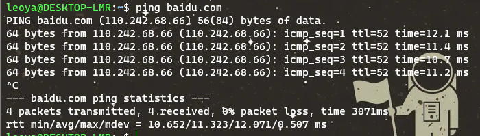

# ping
测试网络是否可达。ping 是基于一种叫做 ICMP 的协议开发的，ICMP 又是一种基于 IP 协议的控制协议，翻译为网际控制协议。


每次显示是按照 sequence 序列号（`icmp_seq`）排序显示的，一并显示的包括 TTL（time to live），反映了两个 IP 地址之间传输的时间。最后两行还显示统计信息，如最小时间、平均时间等。

ICMP报文格式如图所示，每一个ICMP消息都将包含引发这条ICMP消息的数据包的完全IP包头，ICMP报文则作为IP数据包的数据部分封装在IP数据包内部。


ICMP在IP报文后加入了新的内容，这些内容包括：
- 类型：即ICMP的类型, 其中ping的请求类型为8，应答为0。
- 代码：进一步划分ICMP的类型, 用来查找产生错误的原因。
- 校验和：用于检查错误的数据。
- 标识符：通过标识符来确认是谁发送的控制协议，可以是进程ID。
- 序列号：唯一确定的一个报文，前面ping名字执行后显示的icmp\_seq就是这个值。


当我们发起 ping 命令时，ping 程序实际上会组装成如图的一个 IP 报文。报文的目的地址为 ping 的目标地址，源地址就是发送 ping 命令时的主机地址，同时按照 ICMP 报文格式填上数据，在可选数据上可以填上发送时的时间戳。 

IP 报文通过 ARP 协议，源地址和目的地址被翻译成 MAC 地址，经过数据链路层后，报文被传输出去。当报文到达目的地址之后，目的地址所在的主机也按照 ICMP 协议进行应答。之所以叫做协议，是因为双方都会遵守这个报文格式，并且也会按照格式进行发送 - 应答。应答数据到达源地址之后，ping 命令可以通过再次解析 ICMP 报文，对比序列号，计算时间戳等来完成每个发送 - 应答的显示，最终展示出 ping 显示的格式。

# ifconfig
Windows 有一个 ipconfig 命令，用来显示当前的网络设备列表。Linux 有一个对应的命令叫做 ifconfig


```
flags=4163<UP,BROADCAST,RUNNING,MULTICAST>  mtu 1500
```
网卡的状态，MTU 是最大传输单元的意思，表示链路层包的大小。1500 表示的是字节大小。

# netstat
netstat 命令用于显示各种网络相关信息，如网络连接，路由表，接口状态 (Interface Statistics)，masquerade 连接，多播成员 (Multicast Memberships) 等等。

```
netstat -alepn
```


对于 TCP 类型来说，可以清楚地看到一条 TCP 连接的四元组（源地址、源端口、目的地地址和目的端口）。

```
tcp 0 0 10.2.14.55:52304 10.2.14.89:3306 ESTABLISHED 0 97803 9997/./SLW.MonitorS 
```
表达的意思是本地 10.2.14.55 的端口 52304 连上本地 10.2.14.89 的端口 3306，状态为 ESTABLISHED，本地进程为 SLW. MonitorS，进程为 9997。

可以只对 UNIX 套接字进行筛查:

```
netstat Socket -x -alepn
netstat -x -alepn //centos7
```


UNIX 套接字的结果稍有不同，最关键的信息是 Path，这个信息显示了本地套接字监听的文件路径，比如这条：

```
unix  3      [ ]         STREAM     CONNECTED     23209    1400/dockerd        /var/run/docker.sock
```

这其实就是 Docker 在本地套接字的监听路径。/var/run/docker. sock 是本地套接字监听地址，dockerd 是进程名称，1400 是进程号。

# losf
找出在指定的 IP 地址或者端口上打开套接字的进程，而 netstat 则告诉我们 IP 地址和端口使用的情况，以及各个 TCP 连接的状态。Isof 和 netstst 可以结合起来一起使用。

可以通过 lsof 查看是谁打开了这个文件：

```
lsof /var/run/docker.sock
```

下面这张图显示了是 dockerd 打开了这个本地文件套接字：


lsof 还有一个非常常见的用途。如果我们启动了一个服务器程序，发现这个服务器需要绑定的端口地址已经被占用，内核报出“该地址已在使用”的出错信息，我们可以使用 lsof 找出正在使用该端口的那个进程。比如找到使用 8080 端口的那个进程，从而帮助我们定位问题。

```
lsof -i :8080
```

# 抓包利器: tcpdump
指定网卡：

```
tcpdump -i eth0
```

指定来源：

```
tcpdump src host hostname
```

这里抓的包是 TCP，且端口是 80，包来自 IP 地址为 192.168.1.25 的主机地址。

```
tcpdump 'tcp and port 80 and src host 192.168.1.25'
```

如果我们对 TCP 协议非常熟悉，还可以写出这样的 tcpdump 命令：

```
tcpdump 'tcp and port 80 and tcp[13:1]&2 != 0'
```

这里 tcp\[ 13:1 \]表示的是 TCP 头部开始处偏移为 13 的字节，如果这个值为 2，说明设置了 SYN 分节，当然，我们也可以设置成其他值来获取希望类型的分节。注意，这里的偏移是从 0 开始算起的，tcp\[13\]其实是报文里的第 14 个字节。

tcpdump 在开启抓包的时候，会自动创建一个类型为 AF\_PACKET 的网络套接口，并向系统内核注册。当网卡接收到一个网络报文之后，它会遍历系统中所有已经被注册的网络协议，包括其中已经注册了的 AF\_PACKET 网络协议。系统内核接下来就会将网卡收到的报文发送给该协议的回调函数进行一次处理，回调函数可以把接收到的报文完完整整地复制一份，假装是自己接收到的报文，然后交给 tcpdump 程序，进行各种条件的过滤和判断，再对报文进行解析输出。

下面这张图显示的是 tcpdump 的输出格式：


首先我们看到的是时间戳，之后类似 192.168.33.11.41388 > 192.168.33.11.6443 这样的，显示的是源地址（192.168.33.11.41388）到目的地址（192.168.33.11.6443）；然后 Flags \[ \]是包的标志，\[P\]表示是数据推送，比较常见的包格式如下：

- \[S\]：SYN，表示开始连接
- \[.\]：没有标记，一般是确认
- \[P\]：PSH，表示数据推送
- \[F\]：FIN，表示结束连接
- \[R\] ：RST，表示重启连接

我们可以看到最后有几个数据，它们代表的含义如下：

- seq：包序号，就是 TCP 的确认分组
- cksum：校验码
- win：滑动窗口大小
- length：承载的数据（payload）长度 length，如果没有数据则为 0

此外，tcpdump 还可以对每条 TCP 报文的细节进行显示，让我们可以看到每条报文的详细字节信息。这在对报文进行排查的时候很有用。